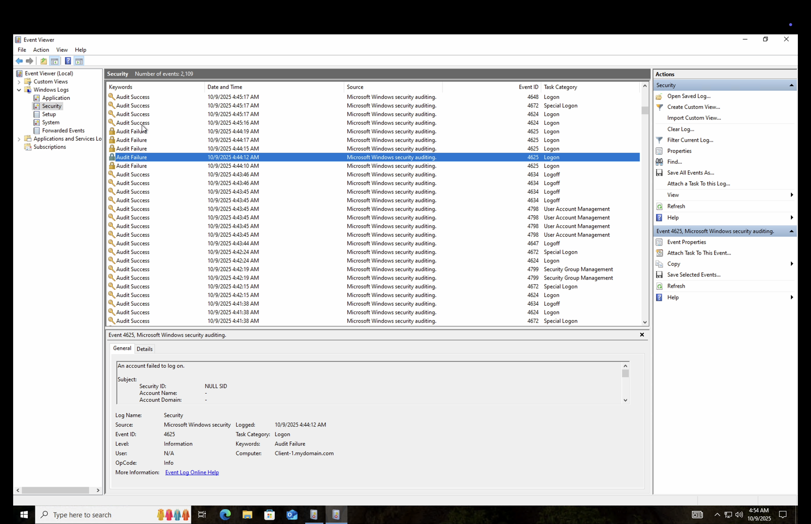

<h1>Building a Simulated On-Premises Active Directory Infrastructure Using Azure Virtual Machines</h1>
This tutorial outlines the implementation of on-premises Active Directory within Azure Virtual Machines. 

<h2>Video Demonstration</h2>

- ### [YouTube: How to Deploy on-premises Active Directory within Azure Compute](https://www.youtube.com)

<h2>Environments and Technologies Used</h2>

- Microsoft Azure (Virtual Machines/Compute)
- Remote Desktop
- Active Directory Domain Services
- PowerShell

<h2>Operating Systems Used </h2>

- Windows Server 2022
- Windows 10 (22H2)

<h2>High-Level Deployment and Configuration Steps</h2>

- Step 1: Install Active Directory Domain Services
- Step 2: Create a Domain Admin Account
- Step 3: Join Client-1 to the Domain
- Step 4: Manage Lab Costs
- Step 5: Enable Remote Desktop for Domain Users
- Step 6: Create Multiple Domain Users
- Step 7: Simulate and Configure Account Lockouts
- Step 8: Enable and Disable User Accounts
- Step 9: Review Security and Event Logs

<h2>Active Directory IT Support Lab</h2>

  

Step 1: Installing Active Directory Domain Services: Logged into DC-1 → Installed Active Directory Domain Services → Promoted it as a Domain Controller (DC) and created a new forest named "mydomain.com" → Restarted the server and logged back in as mydomain.com\labuser.

 

  

Step 2: Created a Domain Admin Account → In Active Directory Users and Computers (ADUC), created an Organizational Units (OUs) named "_EMPLOYEES" and "_ADMINS" → Added a new employee "Jane Doe" → Added "jane_admin" to the <b>Domain Admins</b> group → Logged out of DC-1 and logged back in as "mydomain.com\jane_admin".

 

  

Step 3: Joined Client-1 to the Domain → Restarted Client-1 → Logged in as the local admin "labuser" and joined it to mydomain.com → Verified in ADUC that Client-1 appears under the domain → Created a new OU named "_CLIENTS" and moved Client-1 into it.

 

  

Step 4: Enable Remote Desktop for Domain Users → Powered on DC-1 and Client-1 → Logged into Client-1 as <code>mydomain.com\jane_admin</code> → Opened System Properties → Enabled Remote Desktop access → Allowed <b>Domain Users</b> access → Confirmed non-administrative users can now remotely connect.

 

  

Step 5: Created Multiple Domain Users → Logged into DC-1 as "jane_admin" → Opened <b>PowerShell ISE</b> as Administrator → Ran a script to bulk create multiple new users in the "_EMPLOYEES" OU → Verifed the new accounts in ADUC → Attempted to log into Client-1 using one of the new user accounts.

 

  

Step 6: Simulated and Configured Account Lockouts → On DC-1, picked a random user and attemptted to log in 5 times using an incorrect password → Opened Group Policy Management and configured the Account Lockout Threshold to 5 attempts → Retried logging in 7 times with a bad password → Observed that the account is now locked → Unlocked the account in ADUC, I reset the password, and confirmed successful login.

 

  

Step 7: Enabled and Disabled Accounts → On DC-1, disabled a test user account in ADUC → Attempted to log in and observed the “account disabled” message → Re-enabled the account and verified successful login.

 

  

Step 8: Reviewed Security and Event Logs → Opened Event Viewer on both DC-1 and Client-1 → Observed authentication attempts, account lockouts, and system log activity → Correlated log entries to user actions for troubleshooting and auditing purposes.

 
